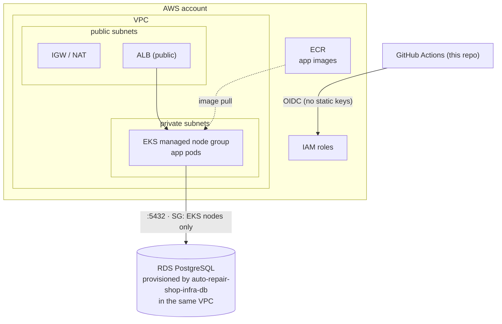

# auto-repair-shop-infra-k8s

Terraform for the Kubernetes cluster (AWS EKS) that runs the
[auto-repair-shop](https://github.com/POS-FIAP-15SOAT-TEAM-DARK-MODE/auto-repair-shop)
application, plus the shared bootstrap (remote state bucket, ECR, GitHub OIDC)
and cluster add-ons. This repository was split out of the app's monorepo as
part of the Fase 3 (Tech Challenge) requirement for 4 independent repositories
with their own CI/CD.

> Managed database (RDS) lives in the sibling
> [auto-repair-shop-infra-db](https://github.com/POS-FIAP-15SOAT-TEAM-DARK-MODE/auto-repair-shop-infra-db)
> repository — it reads the VPC/network outputs from this repo's `aws` state
> via `terraform_remote_state`.

## Technologies

- Terraform (>= 1.10), AWS provider (~> 6.0)
- AWS: VPC, EKS, ECR, IAM (OIDC for GitHub Actions), Secrets Manager access
  (via the `addons` state's External Secrets Operator IRSA role)
- Helm (via the `addons` state): AWS Load Balancer Controller, metrics-server,
  External Secrets Operator
- GitHub Actions (OIDC — no long-lived AWS keys after bootstrap)

## Structure — 4 independent Terraform states

| State | Provisions | Cadence |
|---|---|---|
| `terraform/bootstrap/` | S3 bucket for remote tfstate (versioned, encrypted, native locking) — shared with `auto-repair-shop-infra-db` | run once |
| `terraform/shared/` | ECR (app image repo) · GitHub OIDC provider · IAM roles (`deploy-stg/prd`, `terraform`) | run once |
| `terraform/aws/` | VPC · EKS (per Terraform workspace `stg`/`prd`) | per environment |
| `terraform/addons/` | Helm add-ons: ALB Controller · metrics-server · External Secrets (+ IRSA) | per environment |

```
terraform/
├── bootstrap/   # S3 state bucket (run once)
├── shared/      # ECR + GitHub OIDC + IAM roles (run once)
├── aws/         # VPC, EKS per env (workspaces: stg | prd)
└── addons/      # ALB controller + metrics-server + External Secrets (per env)
```

## Deploy — driven from GitHub Actions

No AWS tooling is needed on your machine; all infra is applied by GitHub
Actions via OIDC (or static keys only for the one-time bootstrap step).

**One-time bootstrap:**
1. Set `github_repo` in `terraform/shared/variables.tf` to
   `POS-FIAP-15SOAT-TEAM-DARK-MODE/auto-repair-shop-infra-k8s` (or the owning
   org/repo, if different).
2. Add repo secrets `AWS_ACCESS_KEY_ID` / `AWS_SECRET_ACCESS_KEY` (an admin
   user) — or the AWS Academy Learner Lab triple
   (`AWS_ACCESS_KEY_ID`/`AWS_SECRET_ACCESS_KEY`/`AWS_SESSION_TOKEN`).
3. Run the **Infra bootstrap (one-time)** workflow — creates the state
   bucket, the GitHub OIDC provider, the IAM roles and ECR, and prints the
   outputs.
4. Remove the static AWS key secrets — everything after this uses OIDC
   (unless on a restricted/Lab account, see below).

**GitHub config** (Settings → Environments):
- `infra` → variable `AWS_TERRAFORM_ROLE_ARN` = shared output
  `terraform_role_arn` (add required reviewers to gate infra applies).

**Provision the cluster** — run the **Infra (Terraform)** workflow
(`workflow_dispatch`) with `action=apply` for each: `aws` stg, `aws` prd,
`addons` stg, `addons` prd. Copy the printed `cluster_name` into the
`auto-repair-shop` app repo's `EKS_CLUSTER_NAME` GitHub Environment variable
(STG/PRD), and share the same value with `auto-repair-shop-infra-db` if it
needs it.

PRs touching `terraform/**` get an automatic `fmt` + `validate` (no
credentials required).

### Restricted accounts (AWS Academy Learner Lab)

Learner Lab accounts forbid creating IAM roles / OIDC providers, so the stack
runs in a degraded mode, auto-detected at runtime from
`aws sts get-caller-identity` (a `voclabs`/`LabRole` caller ⇒
`manage_iam=false`, reusing `LabRole` for the EKS cluster and nodes; no OIDC
provider, deploy/terraform roles or IRSA are created — so the ALB Controller
and External Secrets add-ons are skipped). Override with the `AWS_AUTH_MODE`,
`MANAGE_IAM`, `EXECUTION_ROLE_ARN` repo variables if needed.

## Step-by-step walkthrough (AWS Academy Learner Lab)

A concrete, click-by-click version of the "Deploy" section above, for anyone
running this on a Learner Lab account for the first time.

1. **Get Lab credentials.** In your AWS Academy course, open the Learner Lab,
   click **Start Lab**, wait for the status dot to turn green, then click
   **AWS Details → AWS CLI: Show**. Copy the three values
   (`aws_access_key_id`, `aws_secret_access_key`, `aws_session_token`).
   These expire when the lab session ends or times out — re-fetch them any
   time a workflow run fails on an auth step.

2. **Add them as repo secrets**, not variables (repo-level, not an
   environment): this repo → **Settings → Secrets and variables → Actions →
   Secrets → New repository secret**, three times:
   `AWS_ACCESS_KEY_ID`, `AWS_SECRET_ACCESS_KEY`, `AWS_SESSION_TOKEN`.

3. **Run bootstrap.** Actions tab → **"Infra bootstrap (one-time)"** → Run
   workflow (branch: this feature branch, until merged) → Run workflow. This
   creates the state bucket and, since Learner Lab forbids IAM/OIDC writes,
   `shared` auto-runs in degraded mode: only the ECR repo gets created (no
   `terraform_role_arn`, so skip the `infra` Environment/`AWS_TERRAFORM_ROLE_ARN`
   setup entirely — every later apply just reuses the same static secrets).

4. **Provision the cluster.** Actions tab → **"Infra (Terraform)"** → Run
   workflow → `layer=aws`, `environment=stg`, `action=plan` first to sanity
   check, then re-run with `action=apply`. Takes ~10-15 minutes (EKS control
   plane + node group). This same run auto-chains into applying `addons`
   afterward — expect the IRSA-dependent pieces (ALB Controller, External
   Secrets) to be skipped/degraded, since there's no OIDC provider in Lab mode.

5. **Grab the output.** Expand the "Show outputs" step, copy `cluster_name`
   (e.g. `auto-repair-shop-stg-eks`) — you'll need it in `auto-repair-shop-infra-db`
   and in the app repo.

6. Continue in `auto-repair-shop-infra-db`'s README for the database, then the
   `auto-repair-shop` app repo's `Docker` workflow to actually ship the app.

**Inspecting the live cluster from your machine** (optional, useful for
debugging): install `awscli` + `kubectl` locally, `aws configure` with the
same Lab triple, then:
```bash
aws eks update-kubeconfig --region us-east-1 --name auto-repair-shop-stg-eks
kubectl -n auto-repair-shop get pods
kubectl -n auto-repair-shop logs <pod-name>
```

## Local development

There is no local/Kind path in this repository — the Kind-based full local
Kubernetes environment (build the app image, deploy the workload, HPA, etc.)
lives in the `auto-repair-shop` app repo (`make k8s-up`), since it only needs
Docker and never touches AWS or this Terraform.

For ad hoc `terraform plan`/`kubectl` against a real AWS cluster, install
`terraform`, `kubectl` and the `aws` CLI locally, or reuse the app repo's
toolbox container.

## Swagger / Postman

Not applicable — this repository provisions infrastructure only, no HTTP API
of its own.

## Architecture



## Known issue: seed race on first deploy

On a fresh app deploy, the `auto-repair-shop` pod can boot and run its DB
seed **before** the `db-migrate` Job has finished creating the schema
(nothing here gates the app Deployment's startup on the migrate Job
completing). The seed then fails with a Postgres `42P01` ("relation does not
exist") error that's only logged, never retried — the pod keeps running with
zero seed data. Symptom: seeded logins (`attendant@autorepairshop.com` etc.)
return `401` even though the deploy looked fully green.

**Workaround:** `kubectl -n auto-repair-shop rollout restart deployment/auto-repair-shop`
once migrations have completed — the app re-seeds successfully on the next boot.

**Real fix** (tracked as a follow-up, lives in the `auto-repair-shop` app
repo): add an `initContainer` to the app Deployment that waits for the
migrate Job to complete, or make `RunSeed`'s failure retry/crash-loop instead
of silently discarding the error.

## Related repositories

- [auto-repair-shop](https://github.com/POS-FIAP-15SOAT-TEAM-DARK-MODE/auto-repair-shop) — the application deployed onto this cluster
- [auto-repair-shop-infra-db](https://github.com/POS-FIAP-15SOAT-TEAM-DARK-MODE/auto-repair-shop-infra-db) — managed PostgreSQL, reads this repo's network outputs
