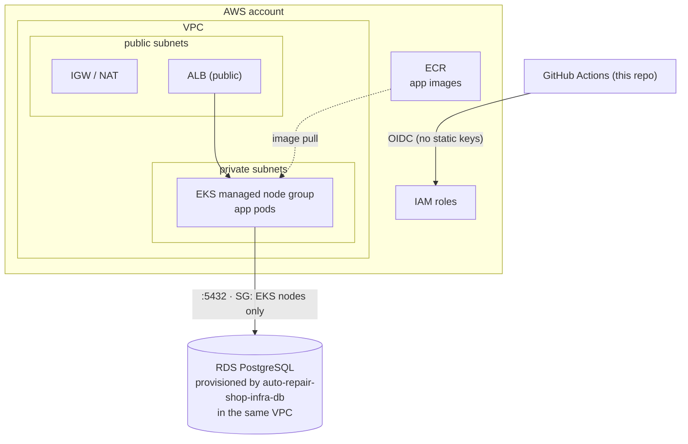

# auto-repair-shop-infra-k8s

Terraform for the Kubernetes cluster (AWS EKS) that runs the
[auto-repair-shop](https://github.com/POS-FIAP-15SOAT-TEAM-DARK-MODE/auto-repair-shop)
application, plus the shared bootstrap (remote state bucket, ECR, GitHub OIDC)
and cluster add-ons. This repository was split out of the app's monorepo as
part of the Fase 3 (Tech Challenge) requirement for 4 independent repositories
with their own CI/CD.

> Managed database (RDS) lives in the sibling
> [auto-repair-shop-infra-db](https://github.com/POS-FIAP-15SOAT-TEAM-DARK-MODE/auto-repair-shop-infra-db)
> repository — it reads the VPC/network outputs from this repo's `aws` state
> via `terraform_remote_state`.

## Technologies

- Terraform (>= 1.10), AWS provider (~> 6.0)
- AWS: VPC, EKS, ECR, IAM (OIDC for GitHub Actions), Secrets Manager access
  (via the `addons` state's External Secrets Operator IRSA role)
- Helm (via the `addons` state): AWS Load Balancer Controller, metrics-server,
  External Secrets Operator, kube-prometheus-stack (Prometheus + Grafana)
- GitHub Actions (OIDC — no long-lived AWS keys after bootstrap)

## Structure — 4 independent Terraform states

| State | Provisions | Cadence |
|---|---|---|
| `terraform/bootstrap/` | S3 bucket for remote tfstate (versioned, encrypted, native locking) — shared with `auto-repair-shop-infra-db` | run once |
| `terraform/shared/` | ECR (app image repo) · GitHub OIDC provider · IAM roles (`deploy-stg/prd`, `terraform`) | run once |
| `terraform/aws/` | VPC · EKS (per Terraform workspace `stg`/`prd`) | per environment |
| `terraform/addons/` | Helm add-ons: ALB Controller · metrics-server · External Secrets (+ IRSA) · kube-prometheus-stack | per environment |

```
terraform/
├── bootstrap/   # S3 state bucket (run once)
├── shared/      # ECR + GitHub OIDC + IAM roles (run once)
├── aws/         # VPC, EKS per env (workspaces: stg | prd)
└── addons/      # ALB controller + metrics-server + External Secrets + kube-prometheus-stack (per env)
```

## Deploy — driven from GitHub Actions

No AWS tooling is needed on your machine; all infra is applied by GitHub
Actions via OIDC (or static keys only for the one-time bootstrap step).

**One-time bootstrap:**
1. Set `github_repo` in `terraform/shared/variables.tf` to
   `POS-FIAP-15SOAT-TEAM-DARK-MODE/auto-repair-shop-infra-k8s` (or the owning
   org/repo, if different).
2. Add repo secrets `AWS_ACCESS_KEY_ID` / `AWS_SECRET_ACCESS_KEY` (an admin
   user) — or the AWS Academy Learner Lab triple
   (`AWS_ACCESS_KEY_ID`/`AWS_SECRET_ACCESS_KEY`/`AWS_SESSION_TOKEN`).
3. Run the **Infra bootstrap (one-time)** workflow — creates the state
   bucket, the GitHub OIDC provider, the IAM roles and ECR, and prints the
   outputs.
4. Remove the static AWS key secrets — everything after this uses OIDC
   (unless on a restricted/Lab account, see below).

**GitHub config** (Settings → Environments):
- `infra` → variable `AWS_TERRAFORM_ROLE_ARN` = shared output
  `terraform_role_arn` (add required reviewers to gate infra applies).

**Provision the cluster** — run the **Infra (Terraform)** workflow
(`workflow_dispatch`) with `action=apply` for each: `aws` stg, `aws` prd,
`addons` stg, `addons` prd. Copy the printed `cluster_name` into the
`auto-repair-shop` app repo's `EKS_CLUSTER_NAME` GitHub Environment variable
(STG/PRD), and share the same value with `auto-repair-shop-infra-db` if it
needs it.

PRs touching `terraform/**` get an automatic `fmt` + `validate` (no
credentials required).

### Restricted accounts (AWS Academy Learner Lab)

Learner Lab accounts forbid creating IAM roles / OIDC providers, so the stack
runs in a degraded mode, auto-detected at runtime from
`aws sts get-caller-identity` (a `voclabs`/`LabRole` caller ⇒
`manage_iam=false`, reusing `LabRole` for the EKS cluster and nodes; no OIDC
provider, deploy/terraform roles or IRSA are created — so the ALB Controller
and External Secrets add-ons are skipped). Override with the `AWS_AUTH_MODE`,
`MANAGE_IAM`, `EXECUTION_ROLE_ARN` repo variables if needed.

## Observability — CPU/memory metrics & dashboards

The `addons` state installs
[kube-prometheus-stack](https://github.com/prometheus-community/helm-charts/tree/main/charts/kube-prometheus-stack)
(Prometheus + Grafana + node-exporter + kube-state-metrics) into the
`monitoring` namespace. It needs no AWS permissions, so it runs the same way
on Learner Lab accounts. Persistence is disabled (no EBS CSI driver is
installed here) — Prometheus keeps 6h of retention in-memory/ephemeral
storage, enough for live dashboards, not for long-term history.

Node/pod CPU and memory come from node-exporter + kube-state-metrics, and
Grafana ships with the chart's default dashboards already provisioned — no
manual dashboard building needed, e.g. **Kubernetes / Compute Resources /
Cluster** and **Node Exporter / Nodes** cover cluster- and node-level CPU out
of the box.

**Access Grafana** — exposed via a plain `LoadBalancer` Service (same
mechanism the app uses in Lab mode, no ALB Controller/IRSA needed), so it has
a real URL instead of requiring `kubectl port-forward`:
```bash
kubectl -n monitoring get svc kube-prometheus-stack-grafana \
  -o jsonpath='{.status.loadBalancer.ingress[0].hostname}'
```
Open that hostname in a browser — login `admin` / `admin`. This fixed login
and public exposure are only acceptable because this is a short-lived Lab
environment for study purposes — swap for a generated secret + restricted
access before any longer-lived deployment.

**Application metrics**: the `auto-repair-shop` app repo ships a `/metrics`
endpoint and a `ServiceMonitor` in its `k8s/manifests/base`. Prometheus here
is configured to pick up *any* ServiceMonitor in the cluster
(`serviceMonitorSelectorNilUsesHelmValues = false`), so no extra wiring is
needed on this side once the app is deployed.

A dashboard for those metrics — **"Auto Repair Shop — App Metrics"** —
is provisioned automatically (`terraform/addons/dashboards.tf` +
`dashboards/app-metrics.json`, loaded via a labeled ConfigMap, same mechanism
as the chart's built-in dashboards): request rate/latency by route, 5xx rate,
service orders created, notification failures, status-transition volume and
average time to reach each status.

**Logs**: `loki-stack` (Loki + Promtail) is also installed into `monitoring`
and wired as a Loki datasource on the same Grafana — use the **Explore** tab
to query container logs (filter by `request_id` to follow one request across
the app's structured JSON logs). No persistence, same short-lived-Lab
reasoning as everything else here.

Control-plane component scraping (`kubeControllerManager`/`kubeScheduler`/
`kubeEtcd`/`kubeProxy`) and Alertmanager are disabled: on managed EKS the
control-plane endpoints aren't reachable, and alerting wasn't part of this
requirement — both can be turned back on later in `terraform/addons/helm.tf`
if the team wants them.

## Local development

There is no local/Kind path in this repository — the Kind-based full local
Kubernetes environment (build the app image, deploy the workload, HPA, etc.)
lives in the `auto-repair-shop` app repo (`make k8s-up`), since it only needs
Docker and never touches AWS or this Terraform.

For ad hoc `terraform plan`/`kubectl` against a real AWS cluster, install
`terraform`, `kubectl` and the `aws` CLI locally, or reuse the app repo's
toolbox container.

## Swagger / Postman

Not applicable — this repository provisions infrastructure only, no HTTP API
of its own.

## Architecture



## Related repositories

- [auto-repair-shop](https://github.com/POS-FIAP-15SOAT-TEAM-DARK-MODE/auto-repair-shop) — the application deployed onto this cluster
- [auto-repair-shop-infra-db](https://github.com/POS-FIAP-15SOAT-TEAM-DARK-MODE/auto-repair-shop-infra-db) — managed PostgreSQL, reads this repo's network outputs
