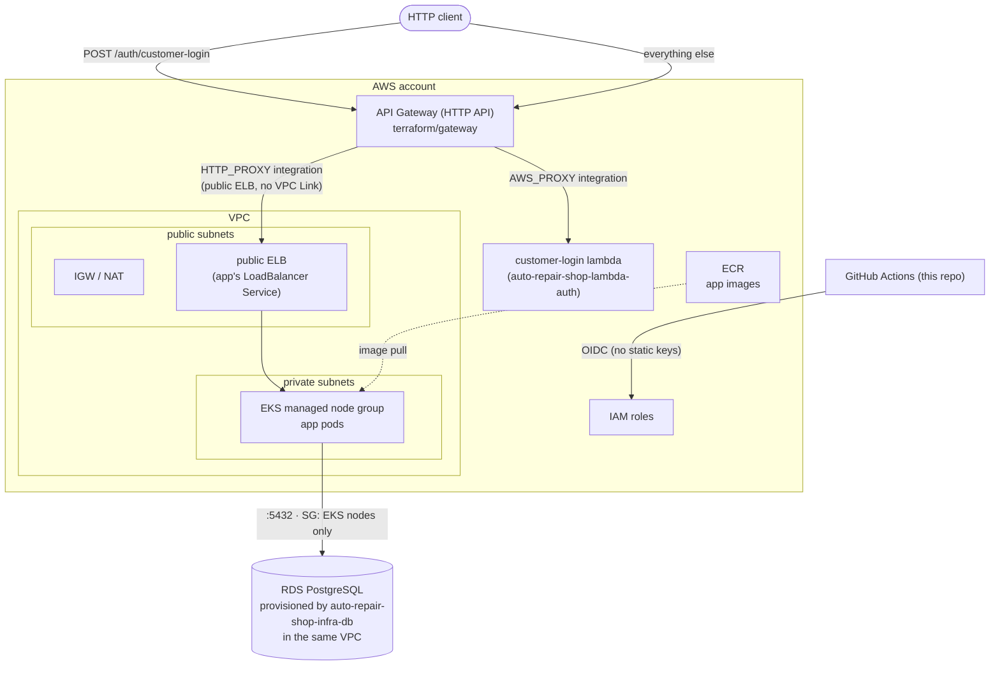

# auto-repair-shop-infra-k8s

Terraform for the Kubernetes cluster (AWS EKS) that runs the
[auto-repair-shop](https://github.com/POS-FIAP-15SOAT-TEAM-DARK-MODE/auto-repair-shop)
application, plus the shared bootstrap (remote state bucket, ECR, GitHub OIDC)
and cluster add-ons. This repository was split out of the app's monorepo as
part of the Fase 3 (Tech Challenge) requirement for 4 independent repositories
with their own CI/CD.

> Managed database (RDS) lives in the sibling
> [auto-repair-shop-infra-db](https://github.com/POS-FIAP-15SOAT-TEAM-DARK-MODE/auto-repair-shop-infra-db)
> repository — it reads the VPC/network outputs from this repo's `aws` state
> via `terraform_remote_state`.

## Technologies

- Terraform (>= 1.10), AWS provider (~> 6.0)
- AWS: VPC, EKS, ECR, IAM (OIDC for GitHub Actions), Secrets Manager access
  (via the `addons` state's External Secrets Operator IRSA role)
- Helm (via the `addons` state): AWS Load Balancer Controller, metrics-server,
  External Secrets Operator
- GitHub Actions (OIDC — no long-lived AWS keys after bootstrap)

## Structure — 5 independent Terraform states

| State | Provisions | Cadence |
|---|---|---|
| `terraform/bootstrap/` | S3 bucket for remote tfstate (versioned, encrypted, native locking) — shared with `auto-repair-shop-infra-db` | run once |
| `terraform/shared/` | ECR (app image repo) · GitHub OIDC provider · IAM roles (`deploy-stg/prd`, `terraform`) | run once |
| `terraform/aws/` | VPC · EKS (per Terraform workspace `stg`/`prd`) | per environment |
| `terraform/addons/` | Helm add-ons: ALB Controller · metrics-server · External Secrets (+ IRSA) | per environment |
| `terraform/gateway/` | AWS API Gateway (HTTP API): routes `/auth/customer-login` to the lambda in `auto-repair-shop-lambda-auth`, everything else to the app | per environment |

```
terraform/
├── bootstrap/   # S3 state bucket (run once)
├── shared/      # ECR + GitHub OIDC + IAM roles (run once)
├── aws/         # VPC, EKS per env (workspaces: stg | prd)
├── addons/      # ALB controller + metrics-server + External Secrets (per env)
└── gateway/     # API Gateway: routes to the lambda + the app (per env)
```

## Deploy — driven from GitHub Actions

No AWS tooling is needed on your machine; all infra is applied by GitHub
Actions via OIDC (or static keys only for the one-time bootstrap step).

**One-time bootstrap:**
1. Set `github_repo` in `terraform/shared/variables.tf` to
   `POS-FIAP-15SOAT-TEAM-DARK-MODE/auto-repair-shop-infra-k8s` (or the owning
   org/repo, if different).
2. Add repo secrets `AWS_ACCESS_KEY_ID` / `AWS_SECRET_ACCESS_KEY` (an admin
   user) — or the AWS Academy Learner Lab triple
   (`AWS_ACCESS_KEY_ID`/`AWS_SECRET_ACCESS_KEY`/`AWS_SESSION_TOKEN`).
3. Run the **Infra bootstrap (one-time)** workflow — creates the state
   bucket, the GitHub OIDC provider, the IAM roles and ECR, and prints the
   outputs.
4. Remove the static AWS key secrets — everything after this uses OIDC
   (unless on a restricted/Lab account, see below).

**GitHub config** (Settings → Environments):
- `infra` → variable `AWS_TERRAFORM_ROLE_ARN` = shared output
  `terraform_role_arn` (add required reviewers to gate infra applies).

**Provision the cluster** — run the **Infra (Terraform)** workflow
(`workflow_dispatch`) with `action=apply` for each: `aws` stg, `aws` prd,
`addons` stg, `addons` prd. Copy the printed `cluster_name` into the
`auto-repair-shop` app repo's `EKS_CLUSTER_NAME` GitHub Environment variable
(STG/PRD), and share the same value with `auto-repair-shop-infra-db` if it
needs it.

**Provision the API Gateway** (`gateway` layer, after the app itself has
been deployed at least once — see below for why):
1. Deploy `auto-repair-shop-lambda-auth` first (its `function_arn` is read
   here via `terraform_remote_state`).
2. Deploy the app (`auto-repair-shop`'s `Docker` workflow) and grab its
   public LoadBalancer hostname from that run's "App is up" summary (or
   `kubectl get svc -n auto-repair-shop auto-repair-shop`).
3. Set repo variable `APP_BACKEND_HOST` to that hostname (Settings →
   Secrets and variables → Actions → Variables — this is not a secret, but
   it does change if the Service is ever recreated, so re-set it after any
   redeploy that gets a new ELB).
4. Run **Infra (Terraform)** with `layer=gateway`, `environment=stg`,
   `action=apply`. Output `api_endpoint` is the public base URL —
   `POST {api_endpoint}/auth/customer-login` for a token, everything else
   proxies straight through to the app.

PRs touching `terraform/**` get an automatic `fmt` + `validate` (no
credentials required).

### Restricted accounts (AWS Academy Learner Lab)

Learner Lab accounts forbid creating IAM roles / OIDC providers, so the stack
runs in a degraded mode, auto-detected at runtime from
`aws sts get-caller-identity` (a `voclabs`/`LabRole` caller ⇒
`manage_iam=false`, reusing `LabRole` for the EKS cluster and nodes; no OIDC
provider, deploy/terraform roles or IRSA are created — so the ALB Controller
and External Secrets add-ons are skipped). Override with the `AWS_AUTH_MODE`,
`MANAGE_IAM`, `EXECUTION_ROLE_ARN` repo variables if needed.

## Local development

There is no local/Kind path in this repository — the Kind-based full local
Kubernetes environment (build the app image, deploy the workload, HPA, etc.)
lives in the `auto-repair-shop` app repo (`make k8s-up`), since it only needs
Docker and never touches AWS or this Terraform.

For ad hoc `terraform plan`/`kubectl` against a real AWS cluster, install
`terraform`, `kubectl` and the `aws` CLI locally, or reuse the app repo's
toolbox container.

## Swagger / Postman

Not applicable — this repository provisions infrastructure only, no HTTP API
of its own.

## Architecture



## Related repositories

- [auto-repair-shop](https://github.com/POS-FIAP-15SOAT-TEAM-DARK-MODE/auto-repair-shop) — the application deployed onto this cluster; the `gateway` state proxies to its public LoadBalancer
- [auto-repair-shop-infra-db](https://github.com/POS-FIAP-15SOAT-TEAM-DARK-MODE/auto-repair-shop-infra-db) — managed PostgreSQL, reads this repo's network outputs
- [auto-repair-shop-lambda-auth](https://github.com/POS-FIAP-15SOAT-TEAM-DARK-MODE/auto-repair-shop-lambda-auth) — the customer-login lambda; the `gateway` state reads its `function_arn` and routes `/auth/customer-login` to it
