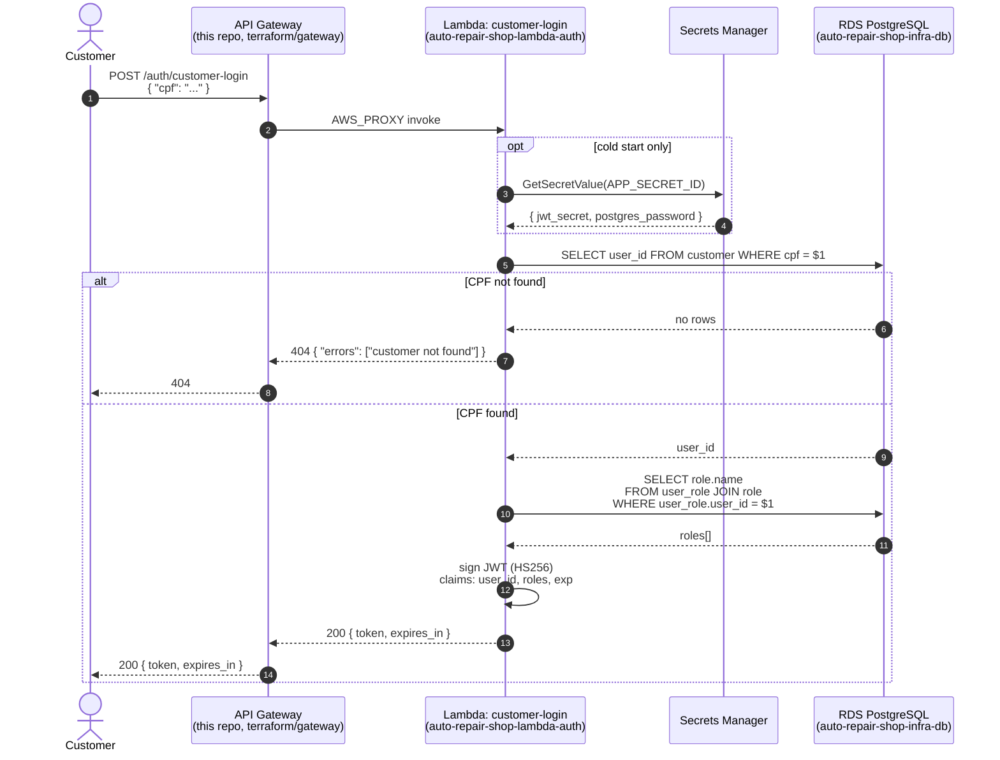
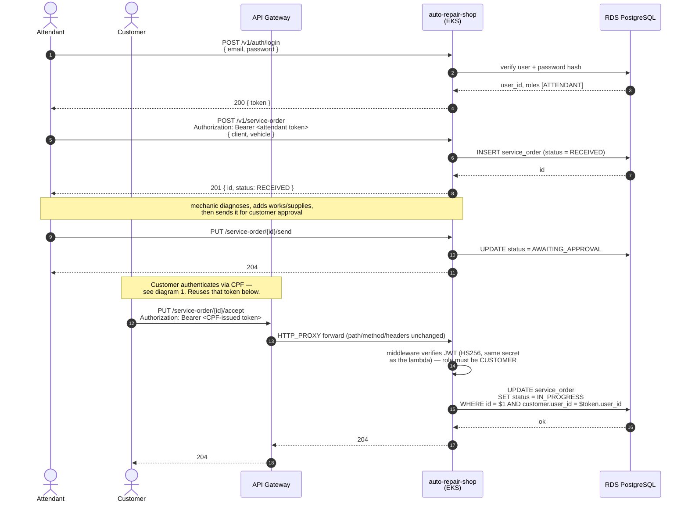

# Sequence diagrams: authentication + service order

Required by the Tech Challenge brief as a distinct artifact from the
component diagrams already in each repo's README (`## Architecture`) —
those show *topology*, these show *the order things happen in*.

Two flows, and they're deliberately connected: the second diagram reuses
the token issued by the first, at the `accept`/`reject` step, to show
where the CPF-based login actually gets consumed downstream rather than
treating it as an isolated feature.

## 1. Customer authentication via CPF

The only flow that touches the API Gateway and the `lambda-auth` function.

## 2. Opening a service order, through to customer approval

Service orders are opened by staff, not customers — `POST /service-order`
requires an **attendant** role, so this flow starts with the app's own
email/password login, not the CPF one. The CPF-issued token from diagram 1
re-enters the picture at step 9, when the customer acts on the order.

## Notes

- The app's auth middleware makes **no extra DB call** to validate a
  token — it trusts the JWT payload entirely, whether that token came
  from the Lambda or from the app's own `/v1/auth/login`. Same secret,
  same claim shape, so both are interchangeable from the middleware's
  point of view (see [auto-repair-shop-lambda-auth's
  README](https://github.com/POS-FIAP-15SOAT-TEAM-DARK-MODE/auto-repair-shop-lambda-auth#request--response)
  for the byte-compatibility note).
- `accept`/`reject` scope by `customer.user_id` — this is the reason the
  lambda still does a minimal DB lookup instead of skipping the database
  entirely (see
  [auto-repair-shop-lambda-auth's ADR 0002](https://github.com/POS-FIAP-15SOAT-TEAM-DARK-MODE/auto-repair-shop-lambda-auth/blob/develop/docs/adr/0002-token-issuance-only-scope.md)).
